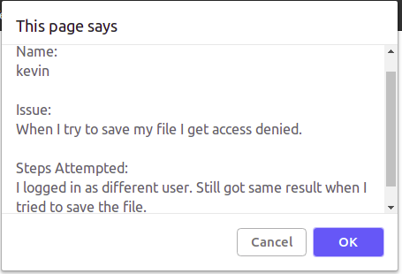

# JavaScript/variables/input/template literals/functions

## Create a user feedback form using prompt
Normally you would have a form but for this challenge, just use prompts to collect the 3 pieces of required information. 
Name, issue, and steps to reproduce the error.

- Prompt for the User's name
- Prompt for the description of the issue they are experiencing
- Prompt for the steps that can be used to re-produce the user's issue
- If the user enters a blank string *for any property*, display an alert to let them know all fields must be populated, and then restart the iteration of the loop so they can reenter all 3 fields again.
- Keep prompting the user *until all 3 fields are provided* otherwise make user start over and enter all 3 fields again.

Once all 3 values collected, use a template literal that displays the entered information using a `confirm` dialog box.
The confirm box should display the information entered.

