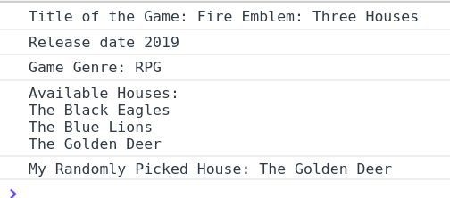

Can you construct the JavaScript object to support the following code? DO NOT modify the provided code, only the object definition!


```
let video_game = {
/*
    ******* YOU MUST POPULATE THE OBJECT TO SUPPORT CODE BELOW ******* 
*/
}

// 
// This function will return a printable string of all the available houses
function getCharacterHouses()
{
    let houses_output_string = '';
    for(step = 0; step < video_game.game_character_houses.length; step++)
    {
        houses_output_string+=`\n${video_game.game_character_houses[step]}`;
    }
    return houses_output_string; // Return the string for printing or other
}


console.log(`Title of the Game: ${video_game.game_title}`); // Print the game title
console.log(`Release date ${video_game.game_release_date}`); // Print release date
console.log(`Game Genre: ${video_game.game_genre}`); // Print genre
console.log(`Available Houses: ${getCharacterHouses()}`) // Print all available houses
console.log(`My Randomly Picked House: ${video_game.pick_random_house()}`); // Pick a random house

```

The code above should produce output like the following:

